# Практическая работа: Тестирование калькулятора на Python

## Цель работы
Познакомиться с методами тестирования программного обеспечения: черный, белый и серый ящик, используя простой калькулятор на Python с графическим интерфейсом.


## 1. Подготовка проекта

1. Склонируйте проект с GitHub:
```bash
  git clone <ссылка_на_репозиторий>
  cd <папка_проекта>
````

2. Создайте виртуальное окружение `.venv` и активируйте его:

```bash
  python -m venv .venv
  # Linux/Mac
  source .venv/bin/activate
  # Windows
  .venv\Scripts\activate
```

3. Установите зависимости через `requirements.txt`:

```bash
  pip install -r requirements.txt
```

4. Запустите калькулятор для проверки:

```bash
  python calculator.py
```

---

## 2. Тестирование

### 2.1 Черный ящик (Black-box testing)

**Цель:** Проверка работы калькулятора через интерфейс без изучения кода.

**Таблица тест-кейсов:**

| № | Ввод        | Ожидаемый результат | Фактический результат | Статус            |
| - | ----------- | ------------------- |-----------------------|-------------------|
| 1 | 2+2         | 4                   | 4                     | Успешно выполнено |
| 2 | 5-3         | 2                   | 2                     | Успешно выполнено |
| 3 | 4*5         | 20                  | 20                    | Успешно выполнено |
| 4 | 10/2        | 5                   | 5.0                   | Успешно выполнено |
| 5 | 3.5+2.1     | 5.6                 | 5.6                   | Успешно выполнено |
| 6 | 5/0         | Ошибка              | Ошибка                | Ошибка            |
| 7 | abc+1       | Ошибка              | Ошибка                | Ошибка            |
| 8 | ..5+1       | Ошибка              | Ошибка                | Ошибка            |
| 9 | (2+3)*(4-1) | 15                  | 15                    | Успешно выполнено |

---

### 2.2 Белый ящик (White-box testing)

**Цель:** Проверка работы калькулятора с анализом кода.

| № | Входные данные | Ветвление кода               | Ожидаемый результат | Фактический результат | Статус            |
| - | -------------- | ---------------------------- | ------------------- |-----------------------|-------------------|
| 1 | 1+1            | Успешное выполнение eval     | 2                   | 2                     | Успешно выполнено |
| 2 | 5/0            | Исключение ZeroDivisionError | Ошибка              | Ошибка                | Ошибка            |
| 3 | пустая строка  | Исключение SyntaxError       | Ошибка              | Ошибка                | Ошибка            |
| 4 | 3+             | Исключение SyntaxError       | Ошибка              | Ошибка                | Ошибка            |
| 5 | 2*3.5          | Успешное выполнение eval     | 7.0                 | 7.0                   | Успешно выполнено |
| 6 | 1..2+3         | Исключение SyntaxError       | Ошибка              | Ошибка                | Ошибка            |

---

### 2.3 Серый ящик (Gray-box testing)

**Цель:** Используем знания о коде, тестируем через GUI.

| № | Ввод        | Ожидаемый результат | Фактический результат | Примечания                   |
| - | ----------- | ------------------- |-----------------------| ---------------------------- |
| 1 | 3+5*2-4/2   | 10                  | 11.0                  | Проверка порядка операций    |
| 2 | (2+3)*(4-1) | 15                  | 15                    | Проверка скобок              |
| 3 | 5++2        | Ошибка              | 7                     | Некорректный ввод            |
| 4 | 10/0        | Ошибка              | Ошибка                | Деление на ноль              |
| 5 | 0.1+0.2     | 0.3                 | 0.30000000000000004   | Проверка дробей              |
| 6 | 7-3*2+1/0   | Ошибка              | Ошибка                | Смешанные операции с ошибкой |

---

## 3. Скриншоты
* 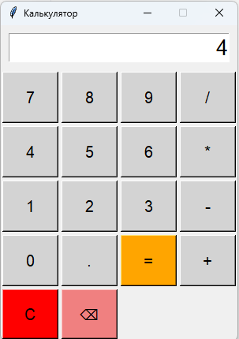
* 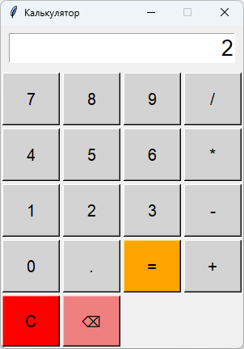
* 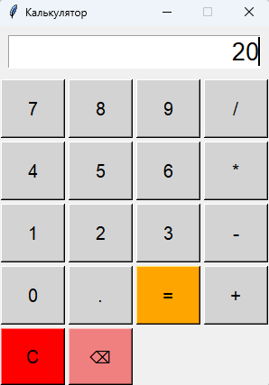
* 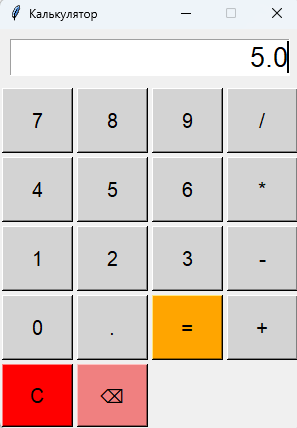
* 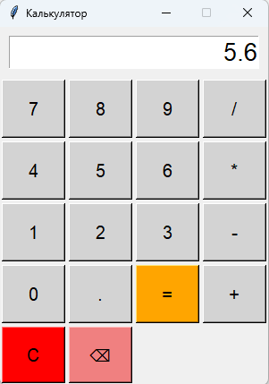
* 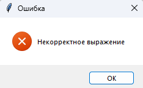
* 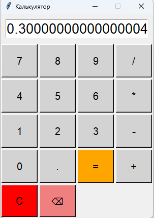
* 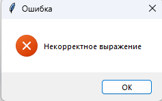
* 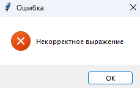
* 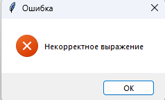
* 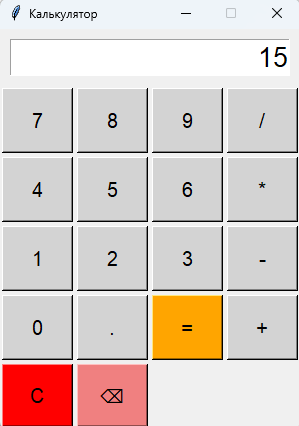
* 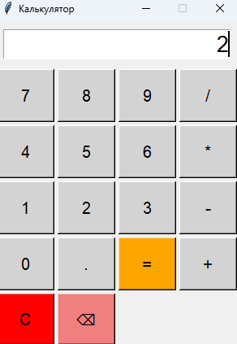
* 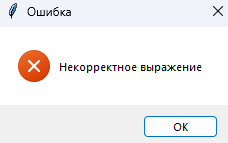
* 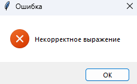
* 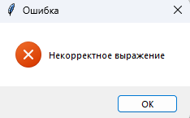
* 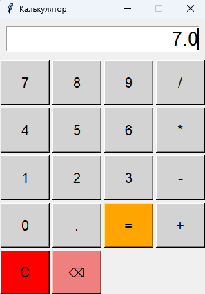
* 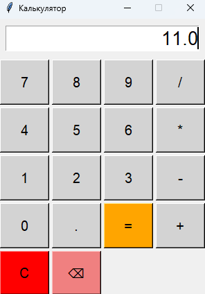
* 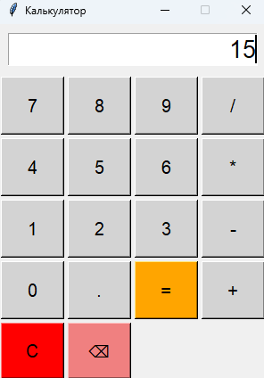
* 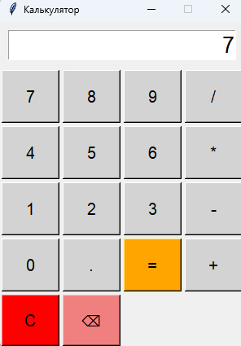
* 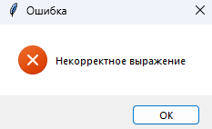
* 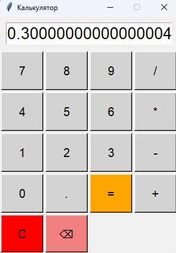
* 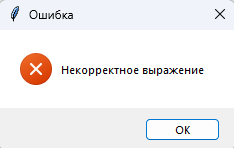

---

## 4. Вывод

* Какие тесты прошли
* Где найдены ошибки
* Общие впечатления о надежности калькулятора

```
